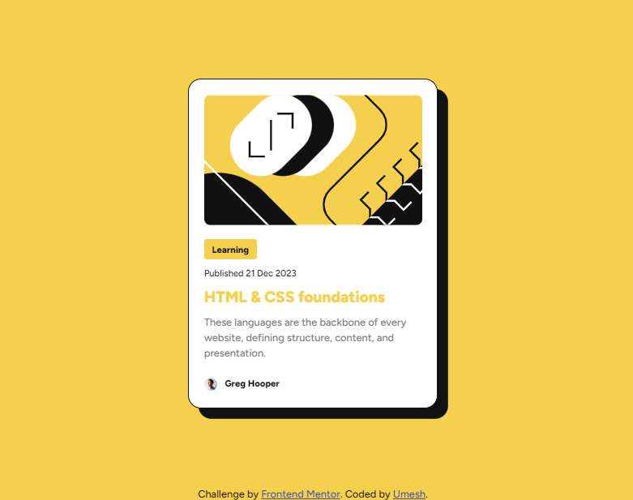

# Frontend Mentor - Contact form solution

This is a solution to the [Contact form challenge on Frontend Mentor](https://www.frontendmentor.io/challenges/contact-form--G-hYlqKJj). Frontend Mentor challenges help you improve your coding skills by building realistic projects. 

## Table of contents

- [Overview](#overview)
  - [The challenge](#the-challenge)
  - [Screenshot](#screenshot)
  - [Links](#links)

**Note: Delete this note and update the table of contents based on what sections you keep.**

## Overview

### The challenge

Users should be able to:

- See hover and focus states for all interactive elements on the page

### Screenshot

### Links

- Solution URL: [https://github.com/umeshsuwal/Frontendmentor-Challanges/tree/main/contact-form-main](https://github.com/umeshsuwal/Frontendmentor-Challanges/tree/main/contact-form-main)
- Live Site URL: [https://umeshsuwal.github.io/Frontendmentor-Challanges/contact-form-main](https://umeshsuwal.github.io/Frontendmentor-Challanges/contact-form-main/)

## Author

- GitHub - [umeshsuwal](https://github.com/umeshsuwal)
- Frontend Mentor - [@umeshsuwal](https://www.frontendmentor.io/profile/umeshsuwal)