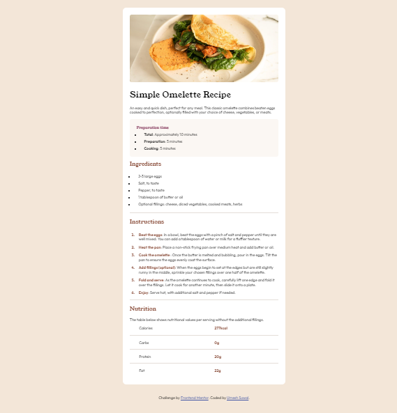

# Frontend Mentor - Recipe page solution

This is a solution to the [Recipe page challenge on Frontend Mentor](https://www.frontendmentor.io/challenges/recipe-page-KiTsR8QQKm). Frontend Mentor challenges help you improve your coding skills by building realistic projects. 

## Table of contents

- [Overview](#overview)
  - [The challenge](#the-challenge)
  - [Built with](#built-with)
  - [Screenshot](#screenshot)
  - [Links](#links)

**Note: Delete this note and update the table of contents based on what sections you keep.**

## Overview

### Built with

- Semantic HTML5 markup
- CSS custom properties
- Flexbox
- CSS Grid

### Screenshot

### Links

- Solution URL: [https://github.com/umeshsuwal/Frontendmentor-Challanges/tree/main/recipe-page-main](https://github.com/umeshsuwal/Frontendmentor-Challanges/tree/main/recipe-page-main)
- Live Site URL: [https://umeshsuwal.github.io/Frontendmentor-Challanges/recipe-page-main/](https://umeshsuwal.github.io/Frontendmentor-Challanges/recipe-page-main/)

## Author

- GitHub - [umeshsuwal](https://github.com/umeshsuwal)
- Frontend Mentor - [@umeshsuwal](https://www.frontendmentor.io/profile/umeshsuwal)
